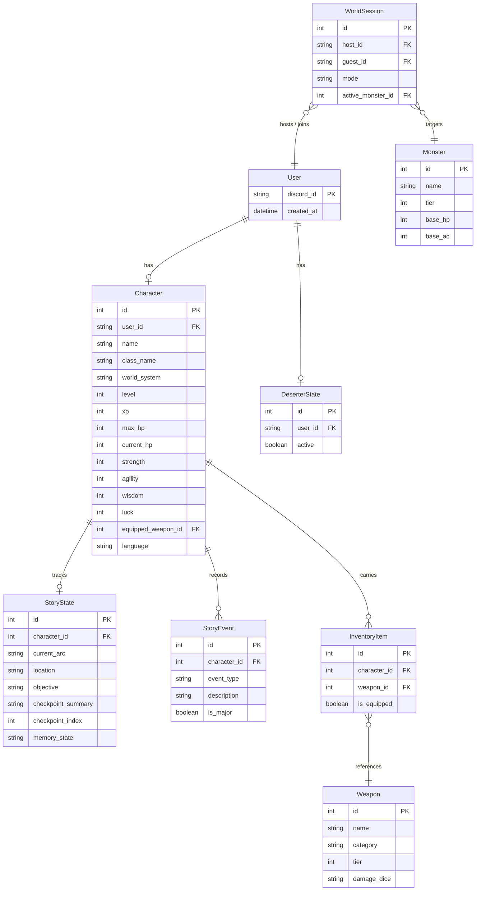

# 🗡️🛡️ Monster Harvesting API & RPG Bot

[](https://python.org)
[](https://fastapi.tiangolo.com)
[](https://discordpy.readthedocs.io/)
[](https://www.sqlalchemy.org/)
[](https://lmstudio.ai/)

Um ecossistema híbrido que combina um **Bot de RPG para Discord** e um **Backend FastAPI** síncrono/assíncrono concorrente. O projeto gerencia aventuras persistentes baseadas em texto, onde um **Game Master de Inteligência Artificial** gera narrativas dinâmicas baseadas nas ações e escolhas do jogador.

---

## 🌟 Principais Recursos

*   **Bot de RPG do Discord**: Comandos baseados em interações de barra (`/`) que permitem aos usuários criar personagens, caçar monstros, gerenciar inventários e progredir em arcos de história.
*   **API Web FastAPI**: Backend completo que expõe rotas HTTP para gerenciar os dados do jogo, permitindo futuras integrações de dashboards web ou ferramentas administrativas.
*   **Game Master Inteligente (IA)**: Integração flexível com o **LM Studio** para gerar descrições de locais, consequências de caçadas e eventos de descanso personalizados a partir de um modelo de linguagem (LLM) rodando localmente.
*   **Mecanismo de Fallback Trilíngue**: Caso a LLM esteja indisponível (offline ou lenta) ou falhe em fornecer uma estrutura JSON válida, o bot ativa instantaneamente um gerador de narrativa clássico, localmente traduzido para **Português (pt-BR)**, **Inglês (en)** ou **Espanhol (es)**.
*   **Engine de Combate Avançada**: Lógica de combate com rolagens de dados, iniciativa determinada pelo modificador de agilidade, acertos críticos baseados em sorte, e cálculos de dano dependentes da categoria de armas (FOR, AGI ou SAB).
*   **Migrações com Alembic**: Banco de dados robusto com controle de versão de esquema, facilitando a atualização de tabelas sem perda de dados históricos.

---

## 🗄️ Arquitetura de Banco de Dados

O projeto utiliza o **SQLite** como motor de banco de dados pela sua simplicidade, facilidade de deploy local e excelente desempenho para aplicações do tipo. A estrutura de dados é gerenciada por meio do ORM **SQLAlchemy** e mapeia as seguintes entidades relacionais:



### Detalhes do Design de Dados
*   **Relacionamento 1-para-1**: Cada `User` do Discord possui no máximo um `Character` ativo.
*   **Inventário Compartilhado**: Os `InventoryItem` apontam para um catálogo global de `Weapon` para evitar duplicação de atributos e simplificar o balanceamento de armas. O inventário é limitado a um máximo de 10 itens na camada de serviço.
*   **Eventos de História**: O histórico completo de aventuras do personagem é mantido na tabela `StoryEvent`, que armazena todas as aventuras de caça (`hunt`), descanso (`rest`), eventos principais (`story`) e criação (`creation`).

---

## 🤖 Configuração de IA Local (LM Studio)

Para que o bot gere descrições dinâmicas e aja como um Game Master virtual, você deve configurar um servidor local de LLM.

### Passo 1: Baixar e Instalar o LM Studio
1. Acesse o site oficial: [lmstudio.ai](https://lmstudio.ai/).
2. Faça o download e a instalação compatível com seu sistema operacional (Windows, macOS ou Linux).

### Passo 2: Baixar o Modelo de Linguagem
1. Abra o LM Studio.
2. Na barra de pesquisa de modelos (ícone de lupa), busque por: **`nvidia/nemotron-3-nano-4b`**.
   > *Nota: Você pode usar outros modelos no formato GGUF como o `Qwen2.5` ou `Llama-3`, mas o Nemotron-3 4B é altamente recomendado por ser extremamente leve e rodar com alta velocidade em máquinas comuns.*
3. Escolha uma das versões quantizadas (por exemplo, `Q4_K_M` ou `Q5_K_M`) e clique em **Download**.

### Passo 3: Iniciar o Servidor Local
1. No menu lateral esquerdo do LM Studio, clique no ícone de desenvolvedor (barra com código ou ícone de tomada/servidor).
2. Na parte superior, selecione o modelo baixado no menu de seleção.
3. No painel direito, certifique-se de que a porta está configurada como `1234`.
4. Clique no botão **Start Server**. O servidor da API local estará rodando em `http://localhost:1234/v1`.

---

## ⚙️ Instalação e Execução

### Pré-requisitos
*   **Python 3.10** ou superior instalado.
*   Um bot criado no [Discord Developer Portal](https://discord.com/developers/applications) com as permissões de Intents ativas (especialmente `Message Content Intent` e `Guild Members Intent`).

### Passo 1: Clonar o Repositório
```bash
git clone https://github.com/Gabs-R/monster-harvesting-api.git
cd monster-harvesting-api
```

### Passo 2: Criar e Ativar o Ambiente Virtual
No Windows:
```powershell
python -m venv .venv
.venv\Scripts\activate
```
No Linux/macOS:
```bash
python3 -m venv .venv
source .venv/bin/activate
```

### Passo 3: Instalar as Dependências
```bash
pip install -r repo/requirements.txt
```

### Passo 4: Configurar as Variáveis de Ambiente
Crie um arquivo `.env` dentro da pasta `repo/` com base no arquivo `.env.example` fornecido:
```env
DISCORD_TOKEN=seu_discord_bot_token
LM_STUDIO_URL=http://localhost:1234/v1
LM_STUDIO_MODEL=nvidia/nemotron-3-nano-4b
```

### Passo 5: Executar Migrações do Banco de Dados
A primeira execução necessita criar as tabelas no arquivo do SQLite. Para isso, execute:
```bash
cd repo
alembic upgrade head
```

### Passo 6: Iniciar o Servidor e o Bot Concorrentes
Para rodar o bot de Discord e a API FastAPI simultaneamente, basta executar o arquivo `run.py` na raiz do projeto (ou dentro da pasta `repo/`):
```bash
python run.py
```
Você verá os logs de carregamento indicando que o servidor FastAPI foi iniciado e o Bot de RPG do Discord realizou o login e sincronizou os comandos.

---

## 🎮 Como Jogar (Comandos do Bot)

Após adicionar o bot ao seu servidor do Discord, use os seguintes comandos de barra (`/`):
*   `/join` - Registra seu usuário e inicia a criação do seu personagem. Escolha sua classe (Mage, Warrior ou Archer) e seu mundo de origem (High Fantasy, Cyberpunk, etc.).
*   `/status` - Exibe os dados detalhados do seu personagem, nível, vida atual, atributos e a arma equipada.
*   `/hunt` - Inicia uma caçada contra monstros selvagens, iniciando combate de turnos baseado nas estatísticas da sua arma.
*   `/coop` - Permite iniciar ou se juntar a sessões cooperativas com outros jogadores para caçarem monstros mais poderosos.
*   `/rest` - Descansa em uma taverna local ou acampamento para restaurar seus pontos de vida (HP) e salvar seu progresso.
*   `/story` - Avança na história personalizada. A IA lerá seus eventos passados e gerará o próximo capítulo da sua jornada!
